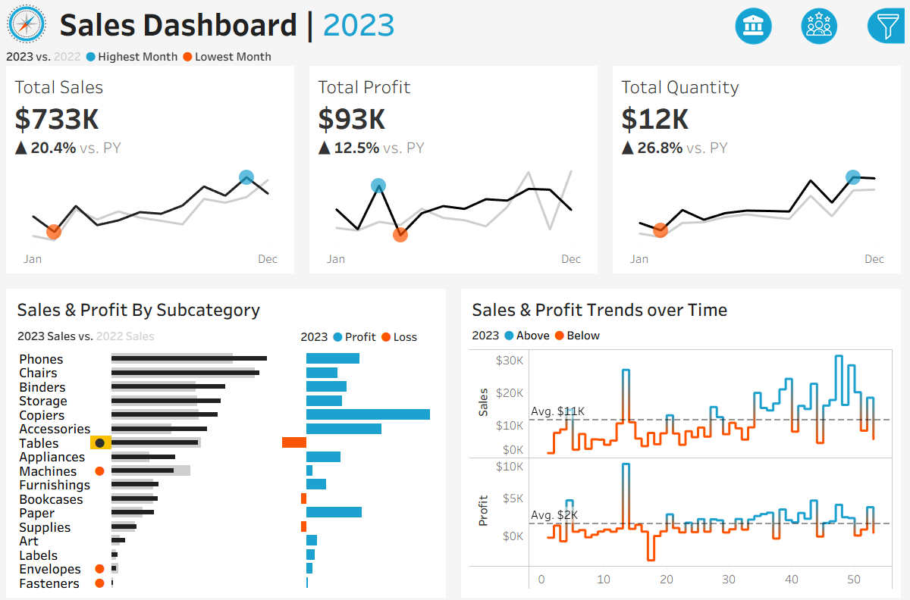
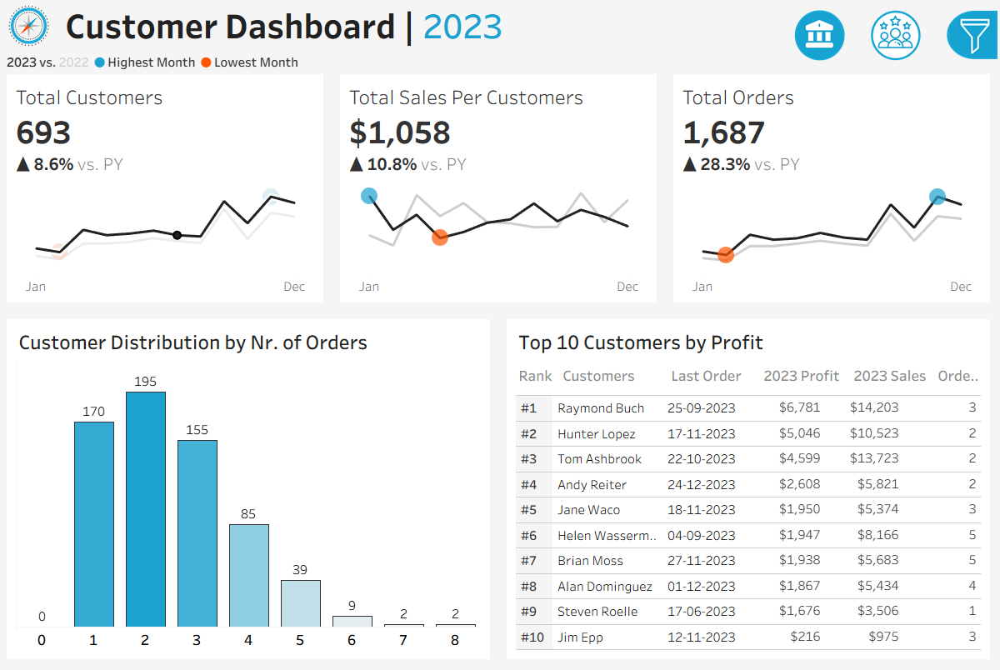
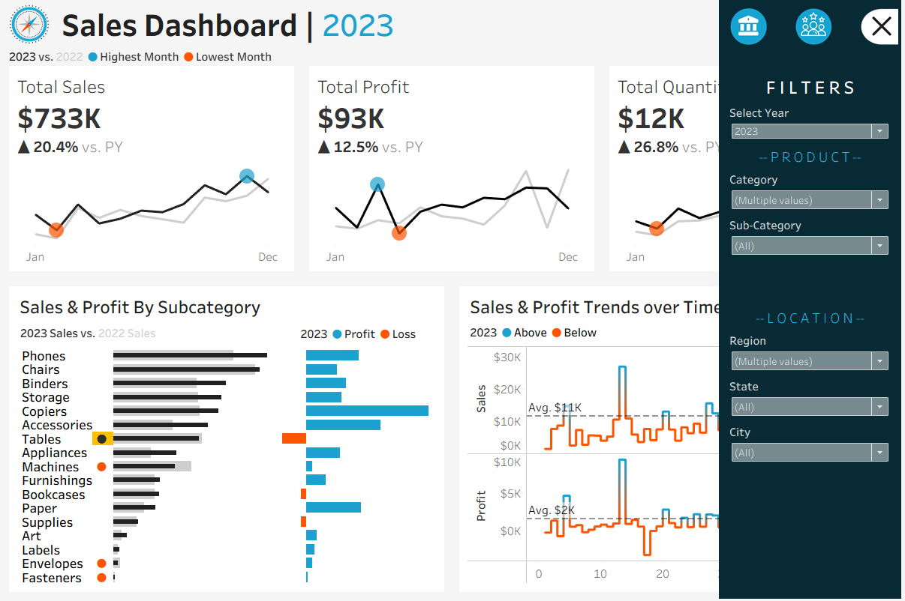

# Sales Performance Analysis Dashboard | Tableau Project

Welcome to my portfolio project demonstrating end-to-end business analytics and dashboard development using **Tableau**. This repository showcases skills in data preparation, visualization, and storytelling — turning raw sales data into actionable insights for business leadership.

---

## 📂 Repository structure

```
text
├── datasets/
│   ├── eu/
│   │   ├── Customers.csv
│   │   ├── Location.csv
│   │   ├── Orders.csv
│   │   └── Products.csv
│   └── non-eu/
│       ├── Customers.csv
│       ├── Location.csv
│       ├── Orders.csv
│       └── Products.csv
│
├── icons/
│   ├── Icon - Customer Dashboard.png
│   ├── Icon - Filter Hidden.png
│   ├── Icon - Filter Shown.png
│   ├── Icon - Logo.png
│   ├── Icon - Sales Dashboard.png
│   ├── Icon - Sales Dashboard(active).png
│   └── README.md
│
├── screenshots/
│   ├── sales_dashboard_overview.png
│   ├── customer_dashboard_overview.png
│   ├── filters_and_navigation.png
│
├── Sales & Customer Dashboards.twbx     # Tableau packaged workbook
├── Tableau_Dashboard_Demo.mp4           # Demo video of dashboard walk-through
└── README.md                            # Project description and documentation
```

---

## 🌐 Project overview

**Sales Performance Analysis Dashboard** is an interactive Tableau project designed to help stakeholders monitor and analyze sales across regions, products, and time. The project includes:

* Executive-level KPI summaries (Sales, Profit, Quantity)
* Year-over-year (YoY) and weekly performance analysis
* Product subcategory comparisons
* Filterable dashboards with custom icons for navigation
* Visualizations for both EU and non-EU regions

This repo covers the full workflow: data import → cleaning → modeling → dashboard design → storytelling (demo video + documentation).

---

## ✨ Key features

* **KPI Summary:** Aggregate Sales, Profit, and Quantity at a glance (CY vs PY)
* **Regional Breakdown:** Separate insights for EU and non-EU markets
* **Trend Visualizations:** Monthly, yearly, and weekly trends with highlights for peaks/troughs
* **Product Insights:** Subcategory-level sales & profit comparisons to reveal growth areas and underperformers
* **Interactivity & UX:** User-friendly filters, clickable visuals, and custom icons for navigation
* **Storytelling:** A guided walkthrough video, screenshots, and clear documentation

---

## 📸 Screenshots

| Sales Dashboard                                                       | Customer Dashboard                                                          | Filters & Navigation                                              |
| --------------------------------------------------------------------- | --------------------------------------------------------------------------- | ----------------------------------------------------------------- |
|  |  |  |

---

## 🔧 Development workflow

1. **Requirements gathering:** Defined KPIs and business questions for sales analysis
2. **Data preparation:** Cleaned and split raw files into `datasets/eu` and `datasets/non-eu`
3. **Modeling & Calculations:** Created calculated fields, parameters (Selected Year), and aggregations in Tableau
4. **Visualization design:** Built charts (KPIs, trend lines, histograms, ranked tables)
5. **Dashboard assembly:** Assembled visuals, icons, and filters for an intuitive UX
6. **Documentation & demo:** Included this README, screenshots, and a video walkthrough (`Tableau_Dashboard_Demo.mp4`)

---

## 🚀 Getting started

* **Data:** See `datasets/eu` and `datasets/non-eu`
* **Open dashboards:** Launch `Sales & Customer Dashboards.twbx` in Tableau Desktop/Public
* **Watch demo:** View `Tableau_Dashboard_Demo.mp4`
* **View screenshots:** Check `/screenshots` folder or preview above

---

## 🎓 Skills demonstrated

* Data cleaning & modeling (CSV handling, multi-region data)
* Advanced dashboard design in Tableau
* UX-focused visualization (custom icons, navigation, filter interactions)
* Business analytics & KPI interpretation
* Technical documentation & presentation (demo video, screenshots, README)

---

## 👤 About me

This project reflects my capabilities as a business/data analyst — combining technical skills with design thinking to communicate actionable insights.

---

## Contributing & License

This project is licensed under the MIT License. You are free to use, modify, and share this project with proper attribution.
